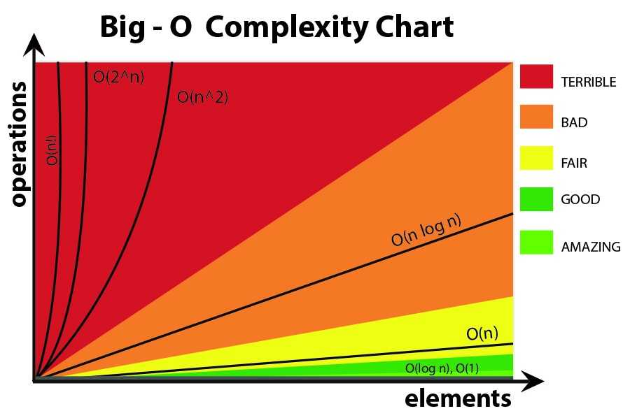
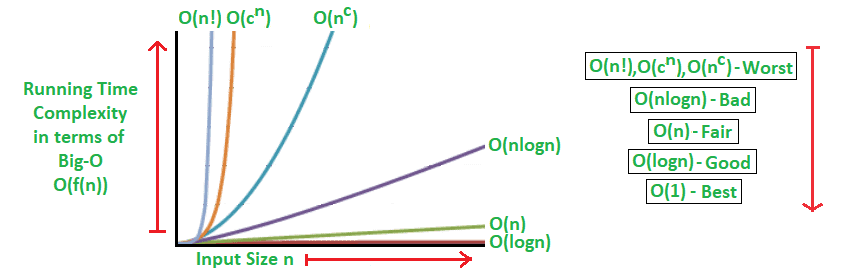

# JavaScript-Algorithms-and-Data-Structures

<h3> Array  - Ordered List of Data,  Duplicates Allowed 
<pre>[1,2,3,4]</pre> </h3>
<h3> Set  - Unordered List of Data,  No Duplicates Allowed 
<pre>new Set ()    set.add('Pizza')</pre> </h3>
<h3> Object  - Key value pair of   Unordered Data,
<pre>{ name : "shatish", experience:"3 year" }</pre> </h3>
<h3> Map  - Key value pair of   ordered Data, iterable Data
<pre> new Map   map.set("shatish", "3 Year")</pre> </h3>

 
 
 
<h3> 👉 To analyze the performance of an algorithms, We use Big O Notation </h3>
<h3> 👉 Big O Notation  can give us a high level understanding of the time or space complexity of an algorithm </h3>
<h3> 👉 Big O Notation doesn't care about precision, only about general trends (linear, quadratic, constant)</h3>
<h3> 👉 The time or space complexity (as measured by Big O) depends only on the algorithm, not hardware used to run the algorithm</h3>
